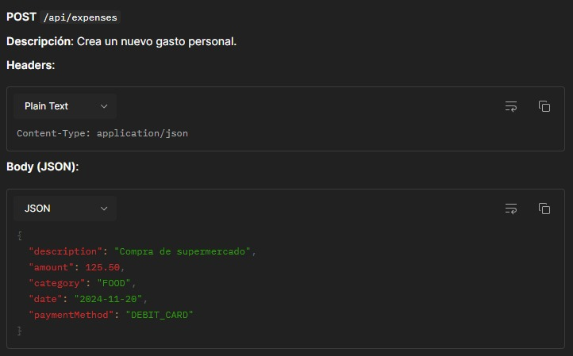
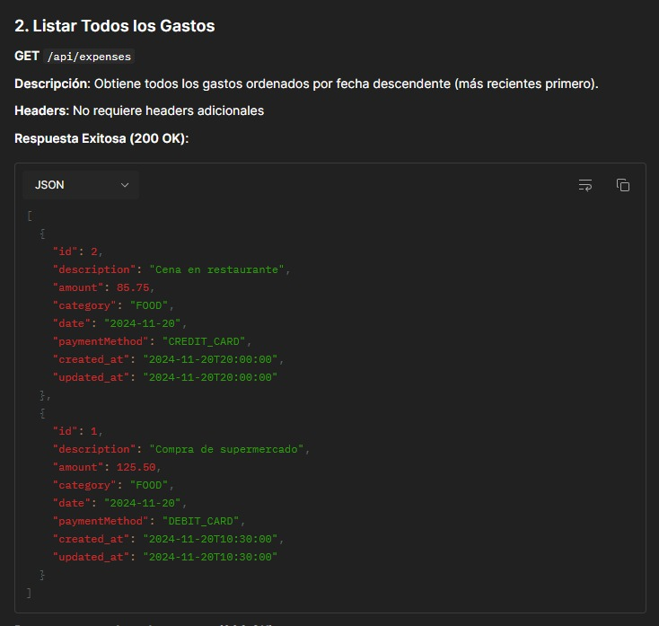
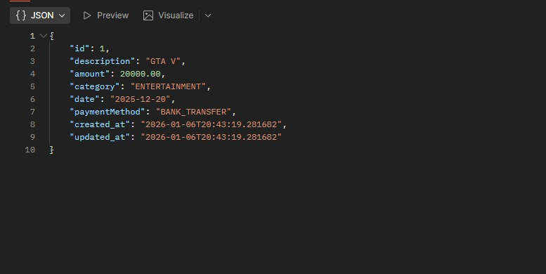
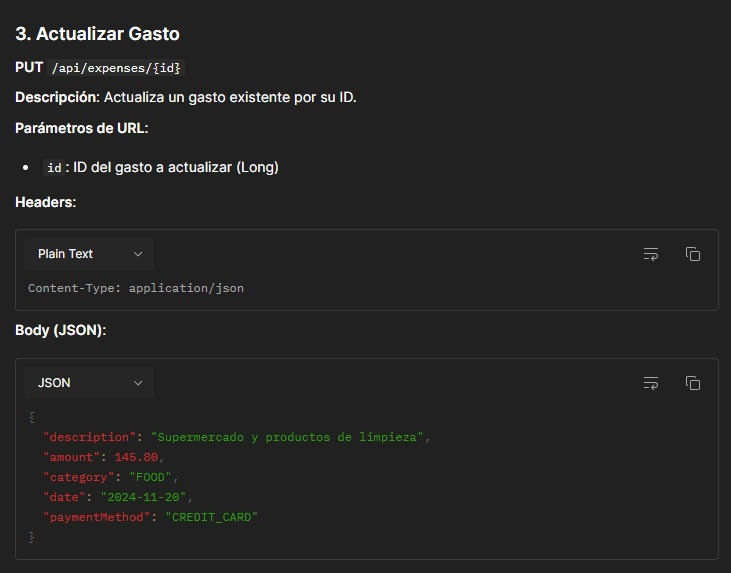
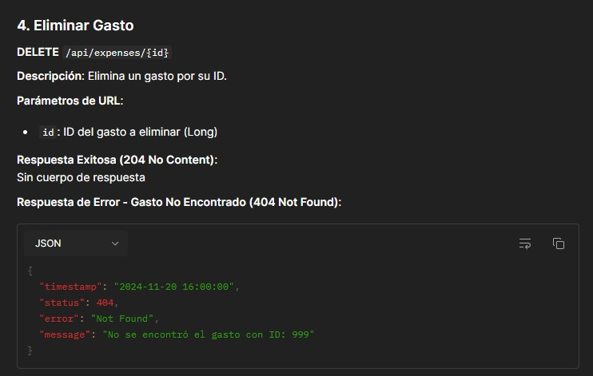
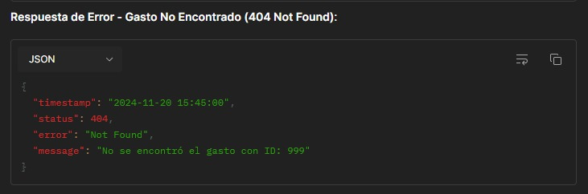

# Proyecto 2: Gestor de Gastos Personales 💰

## Objetivo
Desarrollar un **sistema completo de gestión de gastos personales** utilizando **Spring Boot**, **JPA** y **REST API**, con funcionalidades avanzadas de filtrado y generación de reportes. Este proyecto incluye un CRUD completo, filtros por categoría, método de pago y rango de fechas, además de reportes estadísticos.  
Este proyecto pertenece al **Módulo 1 – CRUD básicos** de la serie de 20 proyectos Spring Boot.

---

## Requisitos del proyecto

### 1. Entidad `Expense`
- **Campos obligatorios:**  
  - `id`: Long, autogenerado  
  - `description`: String, obligatorio, entre 3-200 caracteres  
  - `amount`: BigDecimal, obligatorio, mínimo 0.01, máximo 10 dígitos enteros y 2 decimales  
  - `category`: CategoryEnum, obligatorio (FOOD, TRANSPORT, ENTERTAINMENT, HEALTH, EDUCATION, UTILITIES, SHOPPING, OTHER)  
  - `date`: LocalDate, obligatorio, no puede ser futura  
  - `paymentMethod`: PaymentMethodEnum, obligatorio (CASH, DEBIT_CARD, CREDIT_CARD, BANK_TRANSFER, DIGITAL_WALLET)  
  - `created_at`: LocalDateTime, autogenerado al crear el gasto  
  - `updated_at`: LocalDateTime, autogenerado y actualizado automáticamente  

### 2. Endpoints REST CRUD
- `POST /api/expenses` → Crear gasto  
- `GET /api/expenses` → Listar todos los gastos (ordenados por fecha descendente)  
- `GET /api/expenses/{id}` → Obtener gasto por ID  
- `PUT /api/expenses/{id}` → Actualizar gasto por ID  
- `DELETE /api/expenses/{id}` → Eliminar gasto por ID  

### 3. Endpoints de Filtrado
- `GET /api/expenses/category/{category}` → Filtrar gastos por categoría  
- `GET /api/expenses/payment-method/{paymentMethod}` → Filtrar gastos por método de pago  
- `GET /api/expenses/between?startDate={startDate}&endDate={endDate}` → Filtrar gastos por rango de fechas  

### 4. Endpoints de Reportes
- `GET /api/expenses/reports/by-category` → Reporte agrupado por categoría  
- `GET /api/expenses/reports/period?startDate={startDate}&endDate={endDate}` → Reporte por período  
- `GET /api/expenses/reports/current-month` → Reporte del mes actual  

### 5. Validaciones y manejo de excepciones
- Validaciones de campos obligatorios, rangos y formatos  
- Exception handling global para:  
  - Gasto no encontrado (`ExpenseNotFoundException`)  
  - Argumentos inválidos (`MethodArgumentNotValidException`)  
  - Errores generales (`Exception`)  

### 6. Restricciones técnicas
- No usar DTOs ni relaciones entre entidades  
- Arquitectura en capas: Controller → Service → Repository  
- Persistencia con Spring Data JPA y base de datos MySQL  
- Uso de **Lombok** para getters/setters y constructores  
- Uso de **Enums** para categorías y métodos de pago  

---

## 📋 Tareas Realizadas

### Arquitectura del Proyecto
- ✅ Configuración del proyecto Spring Boot 3.5.7 con Java 21
- ✅ Estructura en capas: Controller → Service → Repository
- ✅ Uso de Spring Data JPA para la persistencia de datos
- ✅ Integración con MySQL como base de datos

### Entidad y Persistencia
- ✅ Creación de la entidad `Expense` con validaciones usando Bean Validation
- ✅ Configuración de JPA con `@Entity`, `@Table`, y anotaciones de Hibernate
- ✅ Implementación de campos automáticos:
  - `id`: Generado automáticamente con `@GeneratedValue`
  - `created_at`: Generado automáticamente con `@CreationTimestamp` (no actualizable)
  - `updated_at`: Actualizado automáticamente con `@UpdateTimestamp`
- ✅ Validaciones implementadas:
  - `@NotBlank` y `@Size` para descripción (3-200 caracteres)
  - `@NotNull`, `@DecimalMin` y `@Digits` para amount (mínimo 0.01, máximo 10 dígitos enteros y 2 decimales)
  - `@NotNull` y `@PastOrPresent` para date (no puede ser futura)
  - `@NotNull` y `@Enumerated` para category y paymentMethod
- ✅ Creación de enums: `CategoryEnum` y `PaymentMethodEnum`

### Capa de Servicio
- ✅ Implementación de la interfaz `ExpenseService` con todos los métodos CRUD
- ✅ Implementación en `ExpenseServiceImpl` con manejo de transacciones (`@Transactional`)
- ✅ Búsqueda de gastos por ID con validación de existencia
- ✅ Actualización de gastos preservando el ID y `created_at`, actualizando solo los campos modificables
- ✅ Eliminación de gastos con validación previa de existencia
- ✅ Implementación de métodos de filtrado:
  - `getAllExpensesByCategory`: Filtrar por categoría
  - `getAllExpensesByPaymentMethod`: Filtrar por método de pago
  - `getAllExpensesByDateBetween`: Filtrar por rango de fechas
- ✅ Implementación de métodos de reportes:
  - `getReportByCategory`: Reporte agrupado por categoría con totales
  - `getReportByPeriod`: Reporte estadístico por período (total, cantidad, promedio)
  - `getCurrentMonthReport`: Reporte del mes actual con categorías más/menos costosas

### Capa de Controlador
- ✅ Creación de `ExpenseController` con mapeo REST `/api/expenses`
- ✅ Implementación de todos los endpoints CRUD:
  - `POST /api/expenses` → Retorna 201 Created
  - `GET /api/expenses` → Retorna 200 OK con lista de gastos ordenados por fecha descendente
  - `GET /api/expenses/{id}` → Retorna 200 OK con gasto específico
  - `PUT /api/expenses/{id}` → Retorna 200 OK con gasto actualizado
  - `DELETE /api/expenses/{id}` → Retorna 204 No Content
- ✅ Implementación de endpoints de filtrado:
  - `GET /api/expenses/category/{category}` → Filtrar por categoría
  - `GET /api/expenses/payment-method/{paymentMethod}` → Filtrar por método de pago
  - `GET /api/expenses/between` → Filtrar por rango de fechas con query parameters
- ✅ Implementación de endpoints de reportes:
  - `GET /api/expenses/reports/by-category` → Reporte por categoría
  - `GET /api/expenses/reports/period` → Reporte por período
  - `GET /api/expenses/reports/current-month` → Reporte del mes actual
- ✅ Uso de `@Valid` para validación automática de entidades
- ✅ Inyección de dependencias con `@RequiredArgsConstructor` (Lombok)
- ✅ Uso de `@DateTimeFormat` para parseo de fechas en query parameters

### Manejo de Excepciones
- ✅ Creación de excepción personalizada `ExpenseNotFoundException`
- ✅ Implementación de `GlobalExceptionHandler` con `@RestControllerAdvice`
- ✅ Manejo de excepciones:
  - `ExpenseNotFoundException` → 404 Not Found con mensaje personalizado
  - `MethodArgumentNotValidException` → 400 Bad Request con detalles de validación
  - `Exception` genérica → 500 Internal Server Error
- ✅ Creación de clase `ErrorResponse` con Builder pattern (Lombok) para respuestas de error estandarizadas

### Repositorio
- ✅ Creación de `ExpenseRepository` extendiendo `JpaRepository<Expense, Long>`
- ✅ Uso de métodos estándar de Spring Data JPA (`findAll`, `findById`, `save`, `deleteById`, `existsById`)
- ✅ Implementación de métodos personalizados con queries derivados:
  - `findByCategoryOrderByDateDesc`: Filtrar por categoría ordenado por fecha descendente
  - `findByPaymentMethodOrderByDateDesc`: Filtrar por método de pago ordenado por fecha descendente
  - `findByDateBetweenOrderByDateDesc`: Filtrar por rango de fechas ordenado por fecha descendente
  - `findAllByOrderByDateDesc`: Obtener todos ordenados por fecha descendente
  - `findByCategoryAndDateBetweenOrderByDateDesc`: Filtrar por categoría y rango de fechas

### Configuración
- ✅ Configuración de MySQL en `application.yml`:
  - Conexión a base de datos `expenses` (creación automática si no existe)
  - Configuración de Hibernate para actualización automática del esquema
  - Formato SQL habilitado para debugging
- ✅ Configuración del puerto del servidor (8080)
- ✅ Configuración de credenciales de base de datos (username: root, password: root)

### Testing con Postman
- ✅ Creación de colección de Postman completa con todos los endpoints
- ✅ Configuración de variables de entorno (`base_url`, `api_path`)
- ✅ Tests automatizados en cada request para validar códigos de estado HTTP
- ✅ Documentación completa de la API incluida en la colección

---

## 🚀 Configuración y Uso

### Requisitos Previos
1. **MySQL** corriendo en `localhost:3306`
2. Base de datos `expenses` (se crea automáticamente si no existe)
3. Credenciales configuradas en `application.yml`:
   - Username: `root`
   - Password: `root`
   - ⚠️ **Importante**: Modifica estas credenciales en `expenses/src/main/resources/application.yml` si tus credenciales de MySQL son diferentes

### Ejecutar el Proyecto
1. Navega a la carpeta del proyecto:
   ```bash
   cd expenses
   ```

2. Ejecuta la aplicación Spring Boot:
   ```bash
   ./mvnw spring-boot:run
   ```
   O en Windows:
   ```bash
   mvnw.cmd spring-boot:run
   ```

3. La API estará disponible en: `http://localhost:8080/api/expenses`

---

## 📬 Colección de Postman

Se incluye una colección completa de Postman para probar todos los endpoints de la API de forma rápida y sencilla. **Para probar más rápido**, descarga e importa el archivo JSON de la colección de Postman incluido en el proyecto.

### Importar la Colección

1. **Abrir Postman**
2. **Importar colección:**
   - Clic en "Import" (esquina superior izquierda)
   - Selecciona el archivo `postman/📝 API Gestor de Gastos.postman_collection.json`
   - O arrastra y suelta el archivo en Postman

3. **Configurar Variables (Opcional pero recomendado):**
   - La colección ya incluye variables por defecto:
     - `base_url`: `http://localhost:8080`
     - `api_path`: `/api/expenses`
   - Puedes crear un entorno en Postman y modificar estas variables si necesitas cambiar la URL base

### Endpoints Incluidos en la Colección

- ✅ **Crear Gasto** (POST) - Con body de ejemplo y test automatizado
- ✅ **Buscar todos los gastos** (GET) - Con test automatizado
- ✅ **Buscar gasto por ID** (GET) - Busca el gasto con ID 1
- ✅ **Actualizar Gasto** (PUT) - Con body de ejemplo y test automatizado
- ✅ **Eliminar Gasto** (DELETE) - Con test automatizado
- ✅ **Filtrar por categoría** (GET) - Ejemplo con categoría FOOD
- ✅ **Filtrar por método de pago** (GET) - Ejemplo con CREDIT_CARD
- ✅ **Filtrar por rango de fechas** (GET) - Con query parameters
- ✅ **Reporte por categoría** (GET) - Reporte agrupado
- ✅ **Reporte por período** (GET) - Con query parameters
- ✅ **Reporte del mes actual** (GET) - Estadísticas del mes

### Notas sobre la Colección

- Todos los requests incluyen tests automatizados que validan los códigos de estado HTTP
- La colección está lista para usar, solo asegúrate de que la aplicación esté corriendo
- Puedes modificar los IDs, categorías, métodos de pago y fechas según tus necesidades
- La documentación completa de cada endpoint está incluida en la descripción de la colección

---

## 📝 Ejemplos de Uso

### Crear un Gasto
**POST** `/api/expenses`

```http
POST http://localhost:8080/api/expenses
Content-Type: application/json

{
  "description": "Compra de supermercado",
  "amount": 125.50,
  "category": "FOOD",
  "date": "2024-11-20",
  "paymentMethod": "DEBIT_CARD"
}
```



---

### Obtener Todos los Gastos
**GET** `/api/expenses`

```http
GET http://localhost:8080/api/expenses
```



---

### Obtener un Gasto por ID
**GET** `/api/expenses/{id}`

```http
GET http://localhost:8080/api/expenses/1
```



---

### Actualizar un Gasto
**PUT** `/api/expenses/{id}`

```http
PUT http://localhost:8080/api/expenses/1
Content-Type: application/json

{
  "description": "Supermercado y productos de limpieza",
  "amount": 145.80,
  "category": "FOOD",
  "date": "2024-11-20",
  "paymentMethod": "CREDIT_CARD"
}
```



---

### Eliminar un Gasto
**DELETE** `/api/expenses/{id}`

```http
DELETE http://localhost:8080/api/expenses/1
```



---

### Error: Gasto No Encontrado
Si intentas obtener, actualizar o eliminar un gasto que no existe, recibirás un error 404:



---

## 🔍 Valores Válidos para Enums

### Categorías (CategoryEnum)
- `FOOD` - Alimentación
- `TRANSPORT` - Transporte
- `ENTERTAINMENT` - Entretenimiento
- `HEALTH` - Salud
- `EDUCATION` - Educación
- `UTILITIES` - Servicios públicos
- `SHOPPING` - Compras
- `OTHER` - Otros

### Métodos de Pago (PaymentMethodEnum)
- `CASH` - Efectivo
- `DEBIT_CARD` - Tarjeta de débito
- `CREDIT_CARD` - Tarjeta de crédito
- `BANK_TRANSFER` - Transferencia bancaria
- `DIGITAL_WALLET` - Billetera digital

⚠️ **Importante**: Los valores de los enums son case-sensitive y deben escribirse exactamente como se muestran (ej: `FOOD`, no `food`).

---

## 🛠️ Tecnologías Utilizadas

- **Spring Boot 3.5.7**
- **Java 21**
- **Spring Data JPA**
- **MySQL 8**
- **Lombok**
- **Bean Validation (Jakarta Validation)**
- **Hibernate**
- **SLF4J** (Logging)

---

## 📊 Estructura del Proyecto

```
expenses/
├── src/
│   ├── main/
│   │   ├── java/com/payoyo/gestor_gastos_personales/
│   │   │   ├── controller/
│   │   │   │   └── ExpenseController.java
│   │   │   ├── entity/
│   │   │   │   ├── Expense.java
│   │   │   │   └── enums/
│   │   │   │       ├── CategoryEnum.java
│   │   │   │       └── PaymentMethodEnum.java
│   │   │   ├── exceptions/
│   │   │   │   ├── ErrorResponse.java
│   │   │   │   ├── ExpenseNotFoundException.java
│   │   │   │   └── GlobalExceptionHandler.java
│   │   │   ├── repositories/
│   │   │   │   └── ExpenseRepository.java
│   │   │   ├── services/
│   │   │   │   ├── ExpenseService.java
│   │   │   │   └── impl/
│   │   │   │       └── ExpenseServiceImpl.java
│   │   │   └── GestorGastosPersonalesApplication.java
│   │   └── resources/
│   │       ├── application.properties
│   │       └── application.yml
│   └── test/
└── ../postman/
    └── 📝 API Gestor de Gastos.postman_collection.json
```

---

## 👨‍💻 Créditos

Este proyecto forma parte de una serie de **20 desafíos de proyectos Java y Spring Boot** creados por:

**José Luis Rodríguez Valenzuela**

- 🔗 [LinkedIn](https://www.linkedin.com/in/joseluispayoyo/)

Agradecimientos especiales por la creación y diseño de estos desafíos que ayudan a practicar y fortalecer las habilidades en desarrollo backend con Spring Boot.

---
