# Proyecto 2: Gestor de Tareas 📋

## Objetivo
Desarrollar una **API REST completa para gestión de tareas (TODO List)** utilizando **Spring Boot**, **JPA** y **REST API**, con énfasis en filtros avanzados, búsquedas y consultas personalizadas.  
Este proyecto pertenece al **Módulo 1 – CRUD básicos** de la serie de 20 proyectos Spring Boot.

---

## Requisitos del proyecto

### 1. Entidad `Task`
- **Campos obligatorios:**  
  - `id`: Long, autogenerado  
  - `title`: String, obligatorio, entre 3-100 caracteres  
  - `description`: String, opcional, máximo 500 caracteres  
  - `status`: Enum (`PENDING`, `IN_PROGRESS`, `COMPLETED`), obligatorio  
  - `priority`: Enum (`LOW`, `MEDIUM`, `HIGH`), obligatorio  
  - `dueDate`: LocalDate, fecha límite (opcional)  
  - `createdAt`: LocalDateTime, autogenerado al crear la tarea  
  - `updatedAt`: LocalDateTime, autogenerado y actualizado automáticamente  

### 2. Endpoints REST

#### CRUD Básico
- `POST /api/tasks` → Crear tarea  
- `GET /api/tasks` → Listar todas las tareas  
- `GET /api/tasks/{id}` → Obtener tarea por ID  
- `PUT /api/tasks/{id}` → Actualizar tarea por ID  
- `DELETE /api/tasks/{id}` → Eliminar tarea por ID  

#### Filtros
- `GET /api/tasks/status/{status}` → Filtrar tareas por estado  
- `GET /api/tasks/priority/{priority}` → Filtrar tareas por prioridad  
- `GET /api/tasks/filter?status=...&priority=...` → Filtrar por estado Y prioridad (combinado)  

#### Búsquedas por Fechas
- `GET /api/tasks/due-date-range?startDate=...&endDate=...` → Buscar tareas por rango de fechas  
- `GET /api/tasks/overdue` → Obtener tareas vencidas (dueDate < hoy AND status != COMPLETED)  
- `GET /api/tasks/due-today` → Obtener tareas que vencen hoy  

#### Búsqueda por Texto
- `GET /api/tasks/search?term=...` → Buscar tareas por término en título o descripción (case-insensitive)  

### 3. Validaciones y manejo de excepciones
- Validaciones de campos obligatorios y rango de caracteres  
- Exception handling global para:  
  - Tarea no encontrada (`TaskNotFoundException`)  
  - Argumentos inválidos (`MethodArgumentNotValidException`)  
  - Errores generales (`Exception`)  

### 4. Restricciones técnicas
- No usar DTOs ni relaciones entre entidades  
- Arquitectura en capas: Controller → Service → Repository  
- Persistencia con Spring Data JPA y base de datos MySQL  
- Uso de **Lombok** para getters/setters y constructores  
- Enums para `status` y `priority`  
- Al menos 2 consultas con `@Query` personalizada  
- `@Transactional` donde corresponda  

---

## Reto opcional (Bonus)
1. ✅ Métodos de negocio en la entidad (`isOverdue`, `markAsCompleted`, `markAsInProgress`)  
2. ✅ Endpoint para contar tareas por estado (`GET /api/tasks/count/status/{status}`)  
3. ✅ Endpoints PATCH para cambiar estado (`PATCH /api/tasks/{id}/in-progress`, `PATCH /api/tasks/{id}/complete`)  
4. ✅ Logging con SLF4J en Service  

---

## 📋 Tareas Realizadas

### Arquitectura del Proyecto
- ✅ Configuración del proyecto Spring Boot 3.5.7 con Java 21
- ✅ Estructura en capas: Controller → Service → Repository
- ✅ Uso de Spring Data JPA para la persistencia de datos
- ✅ Integración con MySQL como base de datos

### Entidad y Persistencia
- ✅ Creación de la entidad `Task` con validaciones usando Bean Validation
- ✅ Configuración de JPA con `@Entity`, `@Table`, y anotaciones de Hibernate
- ✅ Creación de enums `Status` y `Priority` para estados y prioridades
- ✅ Implementación de campos automáticos:
  - `id`: Generado automáticamente con `@GeneratedValue`
  - `createdAt`: Generado automáticamente con `@CreationTimestamp` (no actualizable)
  - `updatedAt`: Actualizado automáticamente con `@UpdateTimestamp`
- ✅ Validaciones implementadas:
  - `@NotBlank` para campos obligatorios
  - `@Size` para límites de caracteres (title: 3-100, description: max 500)
  - `@NotNull` para enums obligatorios
- ✅ **Métodos de negocio en la entidad** (bonus):
  - `isOverDue()`: Verifica si la tarea está vencida
  - `isDueToday()`: Verifica si la tarea vence hoy
  - `markAsInProgress()`: Marca la tarea como en progreso
  - `markAsCompleted()`: Marca la tarea como completada

### Capa de Servicio
- ✅ Implementación de la interfaz `TaskService` con todos los métodos CRUD y filtros
- ✅ Implementación en `TaskServiceImpl` con manejo de transacciones (`@Transactional`)
- ✅ Búsqueda de tareas por ID con validación de existencia
- ✅ Actualización de tareas preservando el ID y `createdAt`, actualizando solo campos modificables
- ✅ Eliminación de tareas con validación previa de existencia
- ✅ Implementación de filtros:
  - Por estado (`findTasksByStatus`)
  - Por prioridad (`findTasksByPriority`)
  - Por estado Y prioridad (`findTasksByStatusAndPriority`)
- ✅ Implementación de búsquedas por fechas:
  - Por rango de fechas (`findTasksByRangeDueDate`)
  - Tareas vencidas (`findTasksOverdue`)
  - Tareas que vencen hoy (`findTasksByDueDate`)
- ✅ Implementación de búsqueda por texto (`findBySearchTerm`)
- ✅ **Logging implementado** (bonus): Registro de todas las operaciones usando `@Slf4j`
- ✅ **Métodos bonus implementados**:
  - `countTasksByStatus`: Cuenta tareas por estado
  - `markTaskAsInProgress`: Marca tarea como en progreso
  - `markTaskAsCompleted`: Marca tarea como completada

### Capa de Controlador
- ✅ Creación de `TaskController` con mapeo REST `/api/tasks`
- ✅ Implementación de todos los endpoints CRUD:
  - `POST /api/tasks` → Retorna 201 Created
  - `GET /api/tasks` → Retorna 200 OK con lista de tareas
  - `GET /api/tasks/{id}` → Retorna 200 OK con tarea específica
  - `PUT /api/tasks/{id}` → Retorna 200 OK con tarea actualizada
  - `DELETE /api/tasks/{id}` → Retorna 204 No Content
- ✅ Implementación de endpoints de filtros:
  - `GET /api/tasks/status/{status}` → Filtrar por estado
  - `GET /api/tasks/priority/{priority}` → Filtrar por prioridad
  - `GET /api/tasks/filter?status=...&priority=...` → Filtro combinado
- ✅ Implementación de endpoints de búsqueda por fechas:
  - `GET /api/tasks/due-date-range?startDate=...&endDate=...` → Rango de fechas
  - `GET /api/tasks/overdue` → Tareas vencidas
  - `GET /api/tasks/due-today` → Tareas que vencen hoy
- ✅ Implementación de búsqueda por texto:
  - `GET /api/tasks/search?term=...` → Búsqueda en título o descripción
- ✅ **Endpoints bonus implementados**:
  - `PATCH /api/tasks/{id}/in-progress` → Marcar como en progreso
  - `PATCH /api/tasks/{id}/complete` → Marcar como completada
  - `GET /api/tasks/count/status/{status}` → Contar tareas por estado
- ✅ Uso de `@Valid` para validación automática de entidades
- ✅ Inyección de dependencias con `@RequiredArgsConstructor` (Lombok)

### Manejo de Excepciones
- ✅ Creación de excepción personalizada `TaskNotFoundException`
- ✅ Implementación de `GlobalExceptionHandler` con `@RestControllerAdvice`
- ✅ Manejo de excepciones:
  - `TaskNotFoundException` → 404 Not Found con mensaje personalizado
  - `MethodArgumentNotValidException` → 400 Bad Request con detalles de validación
  - `Exception` genérica → 500 Internal Server Error
- ✅ Creación de clase `ErrorResponse` con Builder pattern (Lombok) para respuestas de error estandarizadas

### Repositorio
- ✅ Creación de `TaskRepository` extendiendo `JpaRepository<Task, Long>`
- ✅ Uso de métodos estándar de Spring Data JPA (`findAll`, `findById`, `save`, `deleteById`, `existsById`)
- ✅ Implementación de métodos de consulta derivados:
  - `findByStatus`
  - `findByPriority`
  - `findByStatusAndPriority`
  - `findByDueDateBetween`
  - `findByDueDate`
  - `countByStatus`
- ✅ **Consultas personalizadas con `@Query`**:
  - `findOverdueTasks`: JPQL para tareas vencidas
  - `findTasksDueToday`: JPQL para tareas que vencen hoy
  - `searchByTitleOrDescription`: JPQL para búsqueda por texto (case-insensitive)

### Configuración
- ✅ Configuración de MySQL en `application.yml`:
  - Conexión a base de datos `notas` (creación automática si no existe)
  - Configuración de Hibernate para actualización automática del esquema
  - Formato SQL habilitado para debugging
- ✅ Configuración del puerto del servidor (8080)
- ✅ Configuración de credenciales de base de datos (username: root, password: root)

### Testing con Postman
- ✅ Creación de colección de Postman completa con todos los endpoints
- ✅ Configuración de variables de entorno (`base_url`, `api_path`)
- ✅ Tests automatizados en cada request para validar códigos de estado HTTP
- ✅ Documentación completa de la API incluida en la colección

---

## 🚀 Configuración y Uso

### Requisitos Previos
1. **MySQL** corriendo en `localhost:3306`
2. Base de datos `notas` (se crea automáticamente si no existe)
3. Credenciales configuradas en `application.yml`:
   - Username: `root`
   - Password: `root`
   - ⚠️ **Importante**: Modifica estas credenciales en `src/main/resources/application.yml` si tus credenciales de MySQL son diferentes

### Ejecutar el Proyecto
1. Ejecuta la aplicación Spring Boot:
   ```bash
   ./mvnw spring-boot:run
   ```
   O en Windows:
   ```bash
   mvnw.cmd spring-boot:run
   ```

2. La API estará disponible en: `http://localhost:8080/api/tasks`

---

## 📬 Colección de Postman

Se incluye una colección completa de Postman para probar todos los endpoints de la API.

### Importar la Colección

1. **Abrir Postman**
2. **Importar colección:**
   - Clic en "Import" (esquina superior izquierda)
   - Selecciona el archivo `postman/API_Gestor_de_Notas_Personales.json`
   - O arrastra y suelta el archivo en Postman

3. **Configurar Variables (Opcional pero recomendado):**
   - La colección ya incluye variables por defecto:
     - `base_url`: `http://localhost:8080`
     - `api_path`: `/api/tasks`
   - Puedes crear un entorno en Postman y modificar estas variables si necesitas cambiar la URL base

### Endpoints Incluidos en la Colección

- ✅ **Crear Tarea** (POST) - Con body de ejemplo y test automatizado
- ✅ **Buscar todas las tareas** (GET) - Con test automatizado
- ✅ **Buscar tarea por ID** (GET) - Busca la tarea con ID 1
- ✅ **Actualizar Tarea** (PUT) - Con body de ejemplo y test automatizado
- ✅ **Eliminar Tarea** (DELETE) - Con test automatizado
- ✅ **Filtros por estado, prioridad y combinados** - Con tests automatizados
- ✅ **Búsquedas por fechas y texto** - Con tests automatizados
- ✅ **Endpoints bonus** (PATCH y conteo) - Con tests automatizados

### Notas sobre la Colección

- Todos los requests incluyen tests automatizados que validan los códigos de estado HTTP
- La colección está lista para usar, solo asegúrate de que la aplicación esté corriendo
- Puedes modificar los IDs y cuerpos de las peticiones según tus necesidades
- La documentación completa de cada endpoint está incluida en la descripción de la colección

---

## 📝 Ejemplos de Uso

### Crear una Tarea
**POST** `/api/tasks`

```http
POST http://localhost:8080/api/tasks
Content-Type: application/json

{
  "title": "Estudiar Spring Boot",
  "description": "Repasar conceptos de IoC, DI y configuración de Spring",
  "status": "PENDING",
  "priority": "HIGH",
  "dueDate": "2025-11-22"
}
```

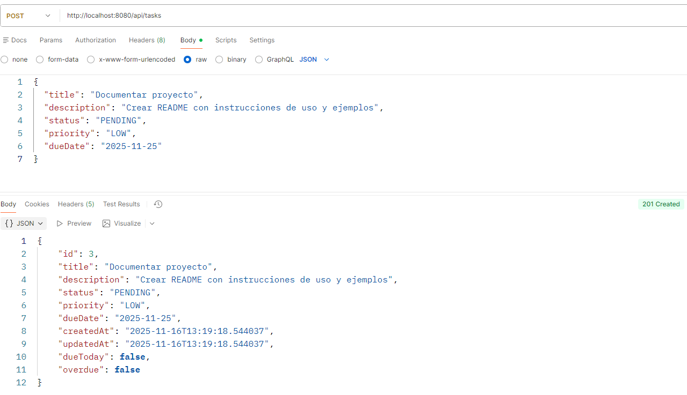

---

### Obtener Todas las Tareas
**GET** `/api/tasks`

```http
GET http://localhost:8080/api/tasks
```

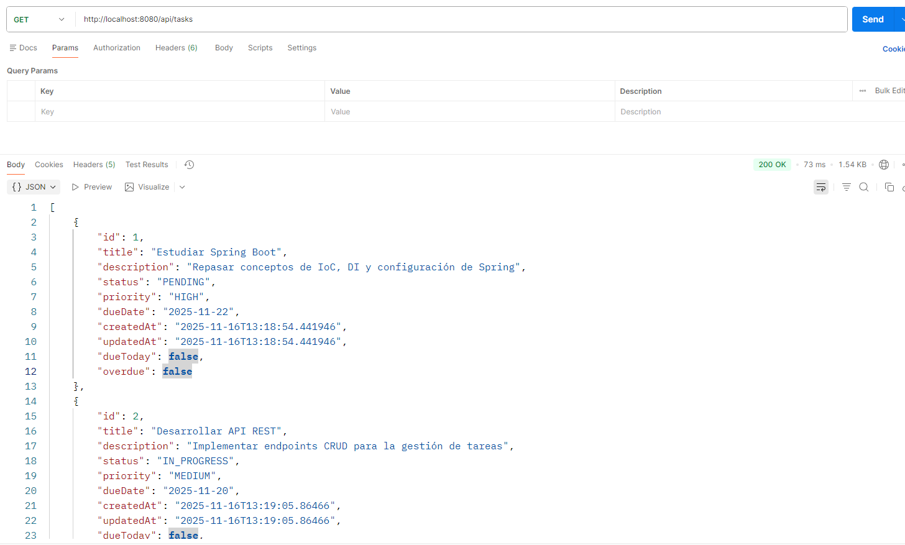

---

### Obtener una Tarea por ID
**GET** `/api/tasks/{id}`

```http
GET http://localhost:8080/api/tasks/1
```

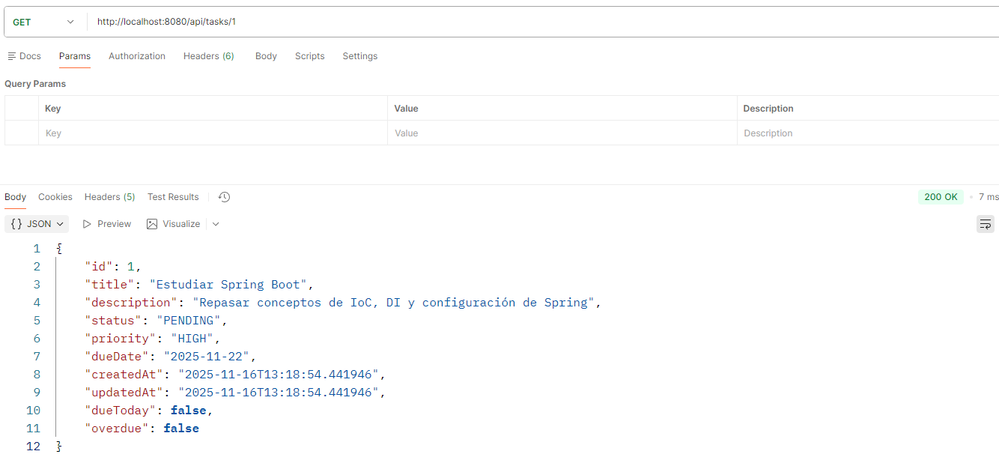

---

### Actualizar una Tarea
**PUT** `/api/tasks/{id}`

```http
PUT http://localhost:8080/api/tasks/1
Content-Type: application/json

{
  "title": "Título actualizado",
  "description": "Descripción actualizada",
  "status": "IN_PROGRESS",
  "priority": "MEDIUM",
  "dueDate": "2025-11-25"
}
```

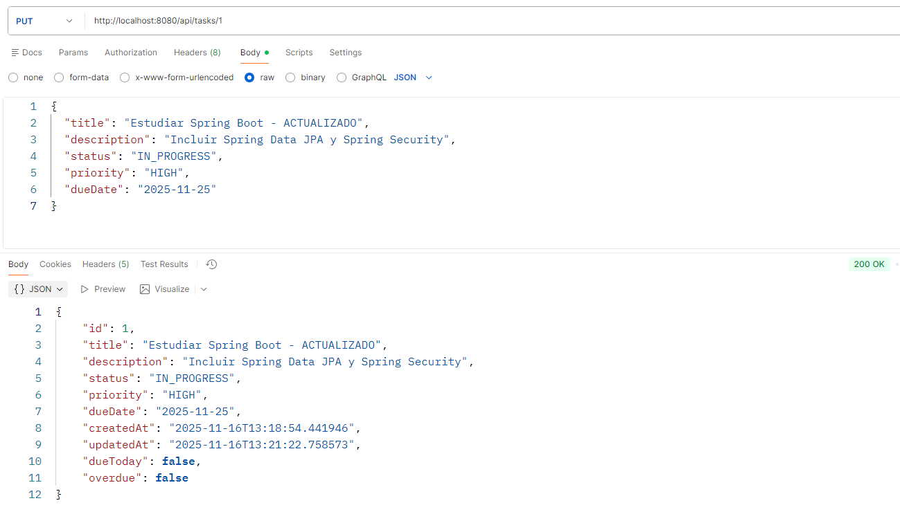

---

### Eliminar una Tarea
**DELETE** `/api/tasks/{id}`

```http
DELETE http://localhost:8080/api/tasks/1
```

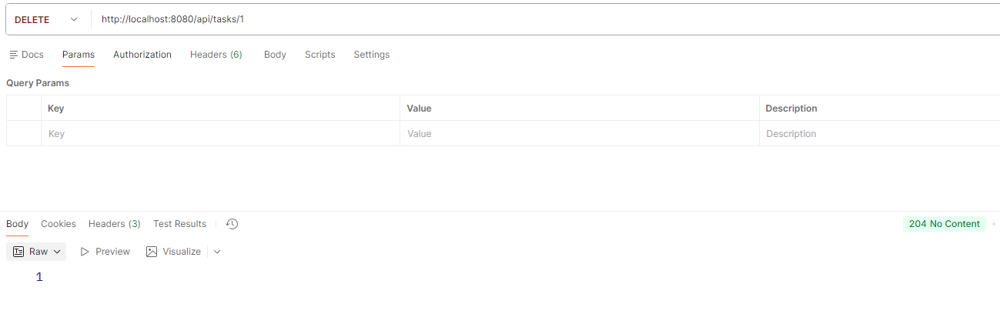

---

### Filtrar Tareas por Estado
**GET** `/api/tasks/status/{status}`

```http
GET http://localhost:8080/api/tasks/status/PENDING
```

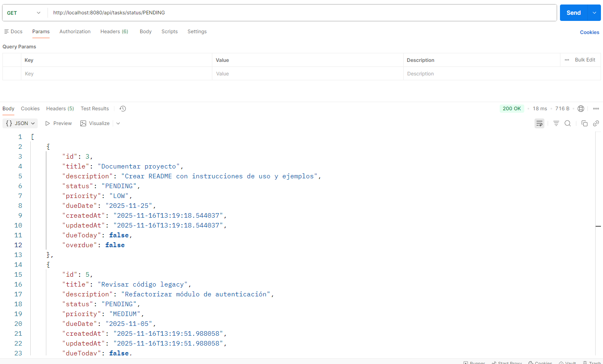

---

### Filtrar Tareas por Prioridad
**GET** `/api/tasks/priority/{priority}`

```http
GET http://localhost:8080/api/tasks/priority/HIGH
```

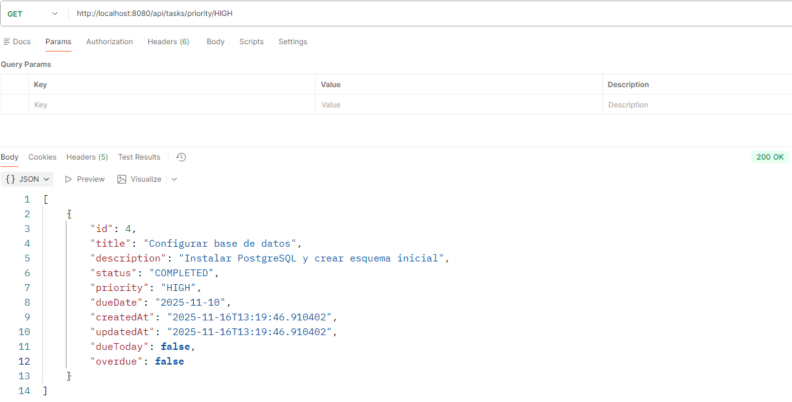

---

### Filtrar Tareas por Estado y Prioridad
**GET** `/api/tasks/filter?status=...&priority=...`

```http
GET http://localhost:8080/api/tasks/filter?status=PENDING&priority=HIGH
```

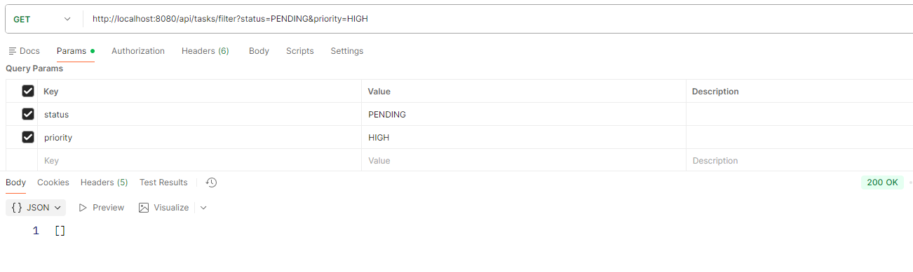

---

### Buscar Tareas por Rango de Fechas
**GET** `/api/tasks/due-date-range?startDate=...&endDate=...`

```http
GET http://localhost:8080/api/tasks/due-date-range?startDate=2025-11-01&endDate=2025-11-30
```

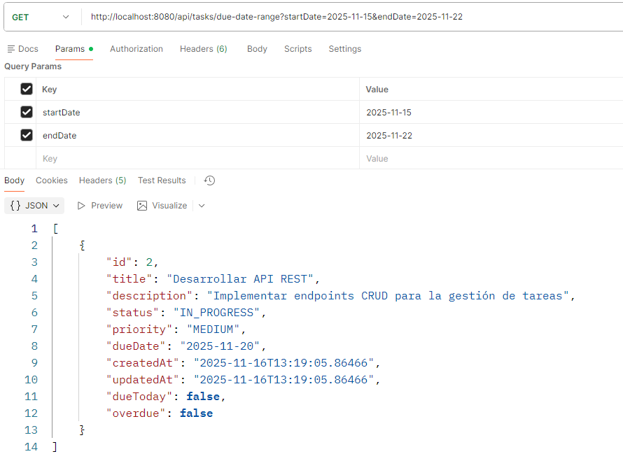

---

### Obtener Tareas Vencidas
**GET** `/api/tasks/overdue`

```http
GET http://localhost:8080/api/tasks/overdue
```

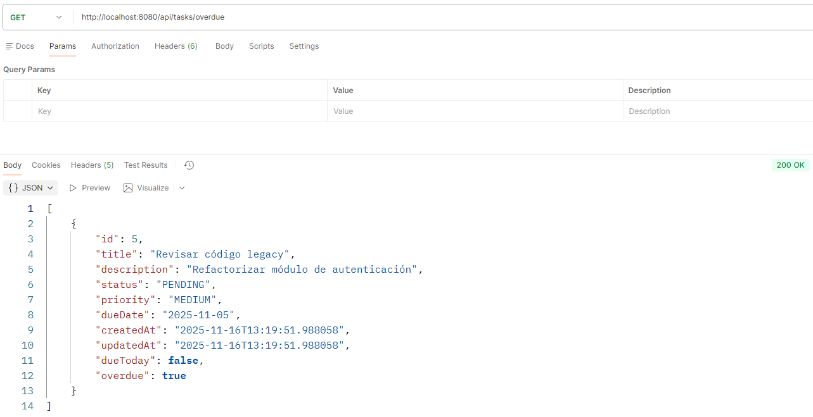

---

### Obtener Tareas que Vencen Hoy
**GET** `/api/tasks/due-today`

```http
GET http://localhost:8080/api/tasks/due-today
```

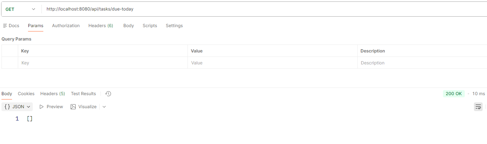

---

### Buscar Tareas por Término
**GET** `/api/tasks/search?term=...`

```http
GET http://localhost:8080/api/tasks/search?term=Spring
```

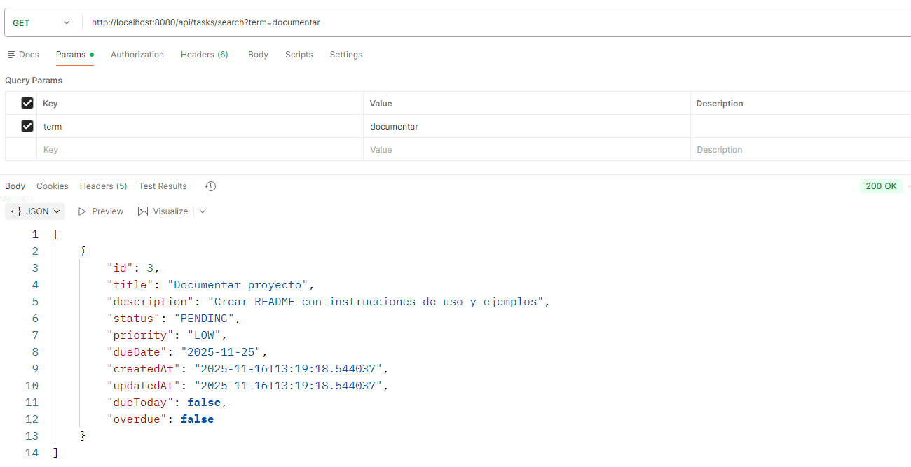

---

### Marcar Tarea como En Progreso (Bonus)
**PATCH** `/api/tasks/{id}/in-progress`

```http
PATCH http://localhost:8080/api/tasks/1/in-progress
```

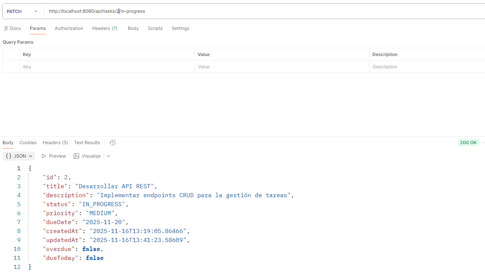

---

### Marcar Tarea como Completada (Bonus)
**PATCH** `/api/tasks/{id}/complete`

```http
PATCH http://localhost:8080/api/tasks/1/complete
```

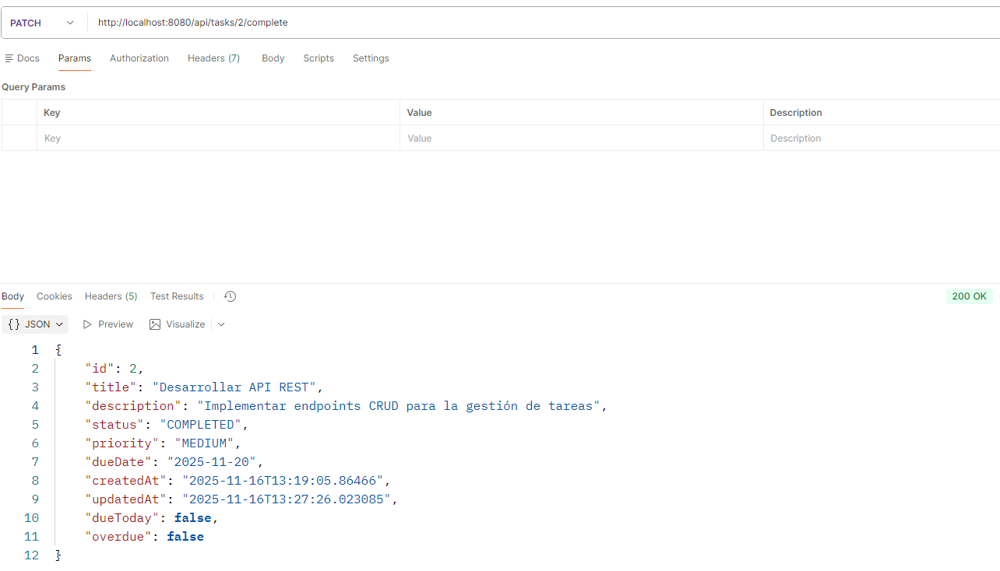

---

### Contar Tareas por Estado (Bonus)
**GET** `/api/tasks/count/status/{status}`

```http
GET http://localhost:8080/api/tasks/count/status/PENDING
```

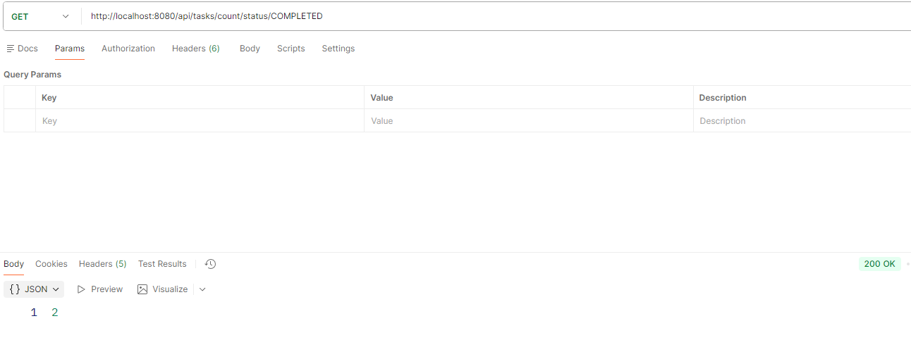

---

### Error: Tarea No Encontrada
Si intentas obtener, actualizar o eliminar una tarea que no existe, recibirás un error 404:

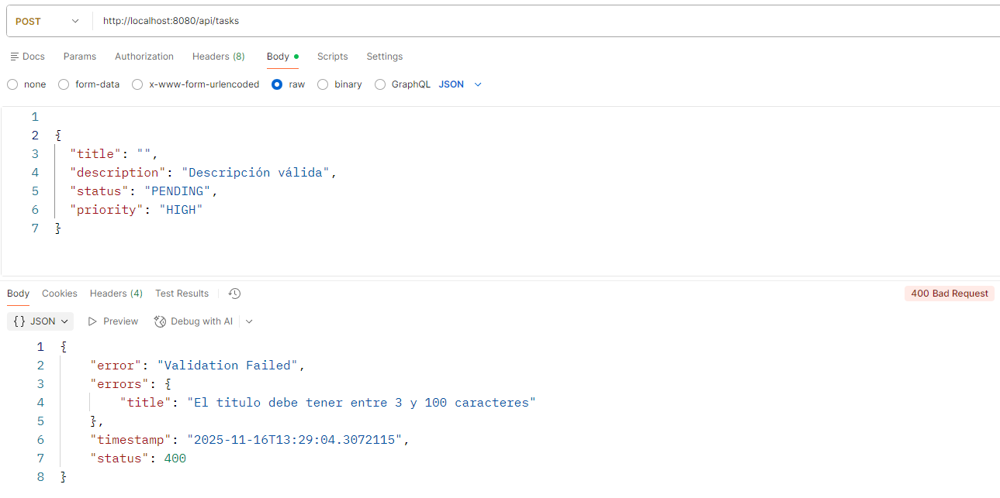

---

### Error: Validación Fallida
Si envías datos inválidos, recibirás un error 400 con detalles de validación:

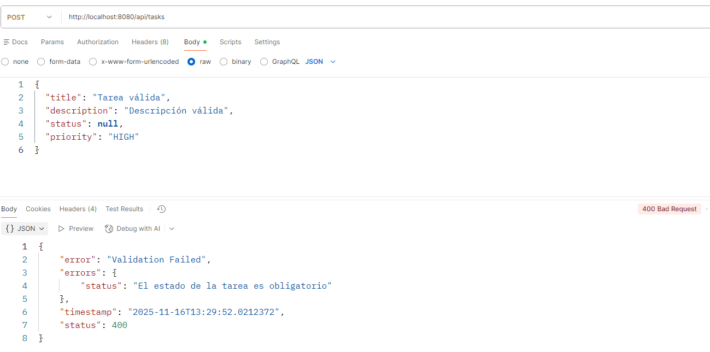

---

## 🛠️ Tecnologías Utilizadas

- **Spring Boot 3.5.7**
- **Java 21**
- **Spring Data JPA**
- **MySQL 8**
- **Lombok**
- **Bean Validation (Jakarta Validation)**
- **Hibernate**
- **SLF4J** (Logging)

---

## 📊 Estructura del Proyecto

```
tasks/
├── src/
│   ├── main/
│   │   ├── java/com/lucam/to_do_list/
│   │   │   ├── controller/
│   │   │   │   └── TaskController.java
│   │   │   ├── entity/
│   │   │   │   └── Task.java
│   │   │   ├── enums/
│   │   │   │   ├── Priority.java
│   │   │   │   └── Status.java
│   │   │   ├── exception/
│   │   │   │   ├── ErrorResponse.java
│   │   │   │   ├── GlobalExceptionHandler.java
│   │   │   │   └── TaskNotFoundException.java
│   │   │   ├── repository/
│   │   │   │   └── TaskRepository.java
│   │   │   ├── service/
│   │   │   │   ├── TaskService.java
│   │   │   │   └── impl/
│   │   │   │       └── TaskServiceImpl.java
│   │   │   └── ToDoListApplication.java
│   │   └── resources/
│   │       ├── application.properties
│   │       └── application.yml
│   └── test/
└── ../postman/
    └── API_Gestor_de_Notas_Personales.json
```

---

## 👨‍💻 Créditos

Este proyecto forma parte de una serie de **20 desafíos de proyectos Java y Spring Boot** creados por:

**José Luis Rodríguez Valenzuela**

- 🔗 [LinkedIn](https://www.linkedin.com/in/joseluispayoyo/)

Agradecimientos especiales por la creación y diseño de estos desafíos que ayudan a practicar y fortalecer las habilidades en desarrollo backend con Spring Boot.

---
